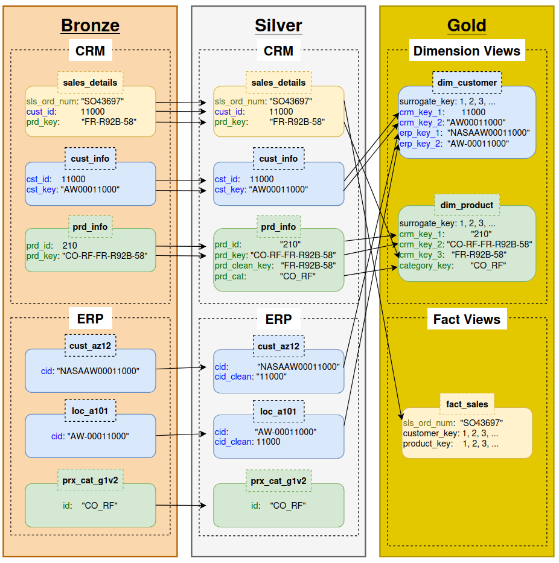

# Customer Orders ELT Project

Welcome! This project focuses on designing a data warehouse using the medallion
architecture and a raw dataset containing information about customers, products,
and example orders. In the bronze layer, I ingest the raw data sources as-is,
and from there, I use `dbt` to manage the data transformation step (including
joining + aggregation into dimension and fact views), constituting the silver
and gold layers. For fun, I orchestrate the whole ELT pipeline with `Airflow`,
though the raw dataset is static.

The high-level goals, design, and raw data are based on [DataWithBaraa's project](https://github.com/DataWithBaraa/sql-data-warehouse-project),
but all code, illustrations, and the implementation in general are entirely my
own.

## Understanding the data sources

There are two sources of raw data, `CRM` and `ERP`. The raw tables contain
information about customers, products, or sales (therefore both). To stay
organized, I tracked identifier columns which were key for joining tables
throughout the layers of the data warehouse. Other informative columns were
dropped for the purposes of this visualization:



## Repository structure

TODO

## Software set-up

Much of this project uses Postgres SQL code executed using `Airflow` and `dbt`,
both of which were installed in a virtual environment with
`uv`. During development, I often used `DBeaver` to interact with my
local Postgres database.

### One-time set-up instructions

```
#   Use uv to set up a virtual environment with dbt for Postgres and Airflow
uv venv --python 3.10
uv pip install dbt-core==1.11.2 dbt-postgres
uv pip install "apache-airflow[celery]==3.1.5" --constraint "https://raw.githubusercontent.com/apache/airflow/constraints-3.1.5/constraints-3.10.txt"
uv pip install apache-airflow-providers-postgres
uv pip install pyhere

#   Since the repo already exists, I do a workaround to get `dbt` files at the
#   top level of the repo
dbt init customer_orders_elt
cp -R customer_orders_elt/* .
rm -r customer_orders_elt

#   Since I'm doing everything locally, I set up the data sources so they're
#   accessible to the Postgres server
sudo cp data/source_CRM/* /var/lib/postgresql/imports/
sudo cp data/source_ERP/* /var/lib/postgresql/imports/
```

### Activating the environment

The Python virtual environment contains the `Airflow` and `dbt` software
```
#   Activate the venv and set an environment variable
source .venv/bin/activate
export AIRFLOW_HOME=$(pwd)/.airflow
```
